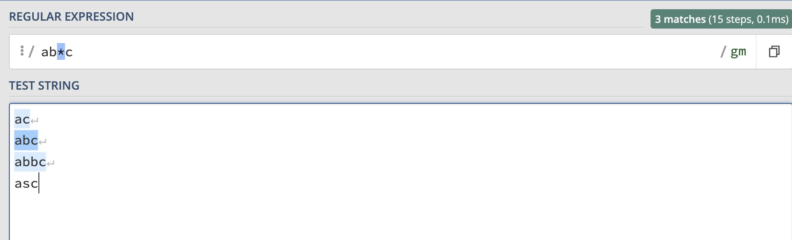
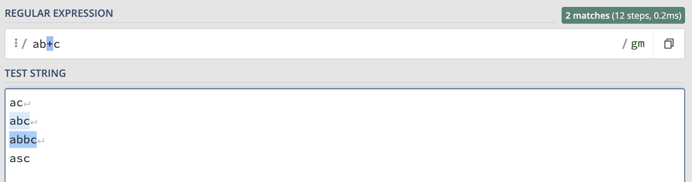
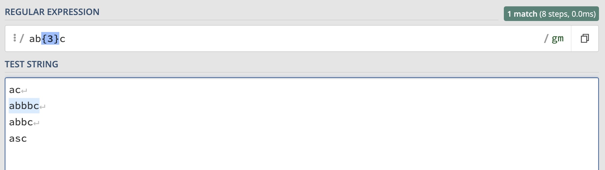
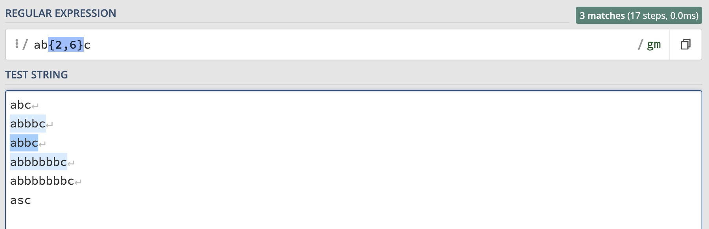
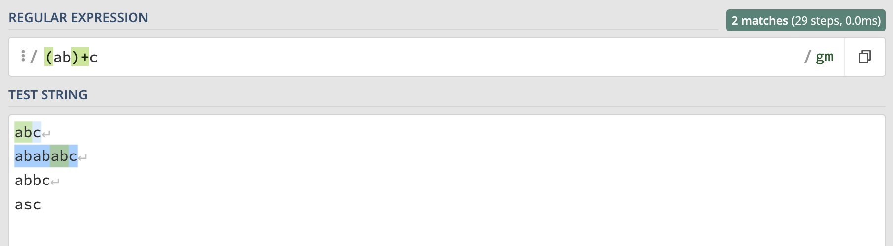
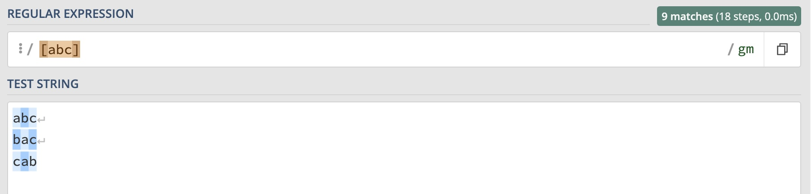
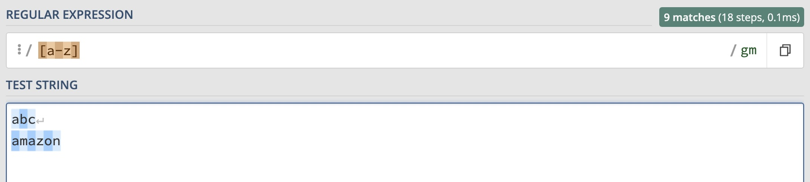
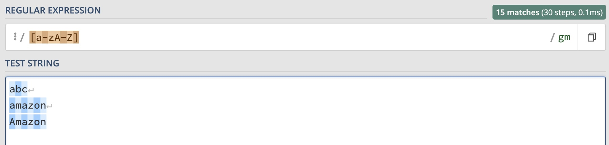
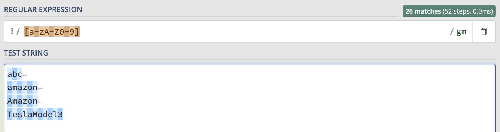
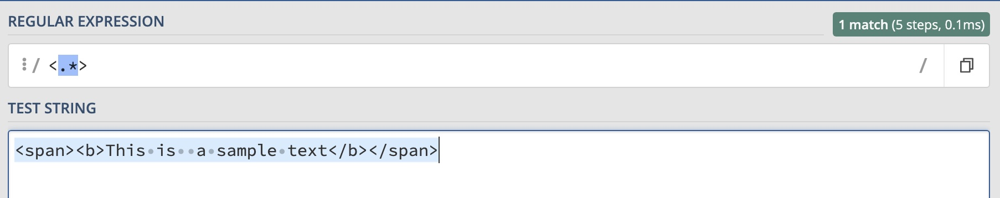

### Quantifier

#### *
> A character appears 0 or more times.


#### +
> A character appears 1 or more times.


#### {3}
> A character appears 3 times.


#### {2,6}
> A character appears 2~6 times. [2, 6].


#### {2, }
> A character appears more than 2 times. [3, +∞).


#### Multi-Character


#### OR


### Character Type
#### [abc]



#### [a-z]



#### [a-zA-Z]



#### [a-zA-Z0-9]



#### Non
##### [^0-9]


Meta-Character
```cmd
\d = [0-9]
\D =[^0-9]
\w = [a-zA-Z0-9_]
\W = [^a-zA-Z0-9_]
\s = space
\S = non space
.* = any character, except for link break.
```

#### ^ Start of string


#### $ End of string


### Greedy Match


### Lazy Match


### Practice
Match the cache template: 
```cmd
bundle{{.Bundle}}:{{.Country}}:sessionid{{mod .Sessionid 32}}:shopid{{mod .Shopid32}}:itemid{{.Itemid}}

regex: ([a-z]*){{([\w\s.]+?)}}
```


> A great regex tool is used in this blog, which is [regex101](https://regex101.com/). 

##### Ref: 
1. https://www.bilibili.com/video/BV1da4y1p7iZ?spm_id_from=333.337.search-card.all.click
2. https://github.com/ziishaned/learn-regex/tree/master/translations
3. 正则表达式30分钟入门教程 作者: deerchao https://deerchao.cn/tutorials/regex/regex.htm
4. Regex tutorial — A quick cheatsheet by examples (英文) 作者: Jonny Fox https://medium.com/factory-mind/regex-tutorial-a-simple-cheatsheet-by-examples-649dc1c3f285
5. Regular Expressions Tutorial (英文) https://www.regular-expressions.info/tutorial.html
