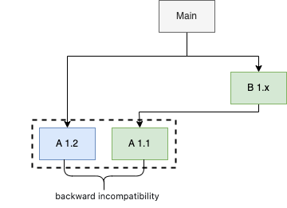

It's easy to encounter some issues in your dependency management. Go module is a dependencies management tool of golang. Go mod is treated as default dependency management tool from go 1.13. And more and more golang developer start to use the Go module to manage their Go project. Based on this, it's necessary to study how to use go mod and how go mod works.

#### Modules, packages, and versions

- **Module**: A module is a collection of packages that are released, versioned, and distributed together, a module is identified by a module path, which is declared in a go.mod file. For example, https://git.garena.com/shopee/deep/bff-rcmd is a module that have several packages in it, it has a go.mod file, whose first line declared the module path:  module git.garena.com/shopee/deep/bff-rcmd . For example, git.garena.com/shopee-server/merlion-monitor is one package of this module. A repo can contain multiple modules. For example,  although git.garena.com/shopee/deep/mnet/trigger is in a subdirectory of git.garena.com/shopee/deep/mnet, in go module definition the former is not to see a package of latter, because trigger has its own go.mod file to declare itself as a module and provide its dependencies information, it's a module what only have one package.

- **Version**: A version identifies an immutable snapshot of a module. For example v1.3.5 and v0.0.0-20210408083853-bea4e61c1705, the former has a semantic version tags but the latter is a pseudo-version, which is compounded of a based version prefix, a timestamp(yyyymmddhhmmssin git it's the commit time) and a 12-character prefix of the commit hash.

- **go.mod file**: A module is defined by a UTF-8 encoded text file named go.mod in its root directory. The go.mod file is line-oriented. Each line holds a single directive, made up of a keyword followed by arguments. For example:

```
module example.com/my/thing

go 1.12 

require example.com/other/thing v1.0.2
require example.com/new/thing/v2 v2.3.4
exclude example.com/old/thing v1.2.3
replace example.com/bad/thing v1.4.5 => example.com/good/thing v1.4.5
retract [v1.9.0, v1.9.5]
```

#### Directives require, go, replace, exclude

##### go
A go directive indicates that a module was written assuming the 
semantics of a given version of Go.

##### require
A require directive declares a minimum required version of a given module dependency. For each required module version, the go command loads the go.mod file for that version and incorporates the requirements from that file. Once all requirements have been loaded, the go command resolves them using minimal version selection (MVS) to produce the build list.
The go command automatically adds // indirect comments for some requirements. An // indirect comment indicates that no package from the required module is directly imported by any package in the main module.

##### replace
A replace directive replaces the contents of a specific version of a module, or all versions of a module, with contents found elsewhere. The replacement may be specified with either another module path and version, or a platform-specific file path.
If a version is present on the left side of the arrow (=>), only that specific version of the module is replaced; other versions will be accessed normally. If the left version is omitted, all versions of the module are replaced.
If the path on the right side of the arrow is an absolute or relative path (beginning with ./ or ../), it is interpreted as the local file path to the replacement module root directory, which must contain a go.mod file. The replacement version must be omitted in this case.
If the path on the right side is not a local path, it must be a valid module path. In this case, a version is required. The same module version must not also appear in the build list.
Regardless of whether a replacement is specified with a local path or module path, if the replacement module has a go.mod file, its module directive must match the module path it replaces.
replace directives only apply in the main module’s go.mod file and are ignored in other modules. See Minimal version selection for details.

##### exclude
An exclude directive prevents a module version from being loaded by the go command.
Since Go 1.16, if a version referenced by a require directive in any go.mod file is excluded by an exclude directive in the main module’s go.mod file, the requirement is ignored. This may cause commands like go get and go mod tidy to add new requirements on higher versions to go.mod, with an // indirect comment if appropriate.

#### Solve backward incompatibility
As shown below, the main module requires 1.2 version of module A and 1.x version of module B, but module B  requires 1.1 version of module A. This situation appears commonly. Of course, module A 1.2 was chosen, because it's the highest version of all required versions.


In the ideal situation, version should be backward compatibility, so choosing the highest version has no problem. But usually the backward compatibility is not satisfied in most modules . For example, the new version may change the signature of function, modules that use the old version will fail in building because function calling in the module does not fit to the new function signature. These are several solutions:
1. Update codes in every module which depended on that module to fit in the highest version. In this case, you should update module B code to depend on A 1.2. This is only available when you can do all of the updating and you need the new feature in the highest version.
2. Find an old version or commit that satisfying all modules, use go get to downgrade to that version. For example, you find that v1.2.0 satisfying all modules, you can run 'go get <module_name>@v1.2.0', or you find that a commit satisfying all modules, you can run 'go get <module_name>@<first 12 chars of the commit hash>'. This is only available when you don't need the new features of the highest version.
3. Find an old version that satisfying all module and add 'replace' directive to appoint that version in go.mod file. You can see some 'replace' in the go.mod file show above. This is not recommended if you can solve the conflict in the above two ways. And this solution is also only available when you don't need the new features of the highest version.

#### Start to use go mod

1. go mod init <your module name, for example git.garena.com/zhaozw/cgzip> (create a go.mod file that contains module name)
2. go mod tidy (to add requires in go.mod file)

> go mod tidy ensures that the go.mod file matches the source code in the module. It adds any missing module requirements necessary to build the current module’s packages and dependencies, and it removes requirements on modules that don’t provide any relevant packages. It also adds any missing entries to go.sum and removes unnecessary entries.
3. go mod vendor  

> The go mod vendor command constructs a directory named vendor in the main module’s root directory that contains copies of all packages needed to support builds and tests of packages in the main module.
4. go test (test the code can run correctly when depending on the modules in go.mod or not)

#### How to update dependency
If you need a new feature from a new version of module A, you need to do the following:
```
cd <your project root path>
go get <module A>@<new feature branch>
go mod vendor
```
#### How  to know why a module or a package is required by
**go mod why** can help you to see why your module requires a certain module or package.
For example, you need to know why git.garena.com/common/gocommon is required by your module, you can run **go mod why -m git.garena.com/common/gocommon** then a shortest dependency path from your module to gocommon will be printed.


#### Advices
1. As a maintainer, keep backward compatibility as much as you can. https://blog.golang.org/module-compatibility
2. Use the same version of a certain module if it's possible for all of your modules.